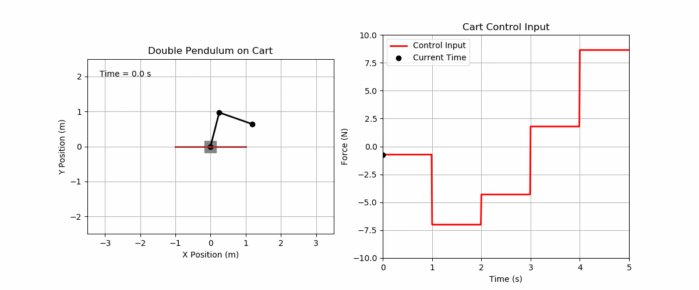
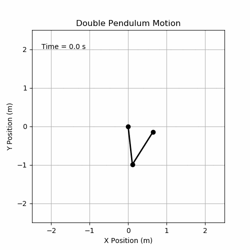

# Double-Pendulum-NN: Double Pendulum Simulations for Neural Network Training

## Table of Contents
- [Overview](#overview)
- [Requirements](#requirements)
- [Project Structure](#project-structure)
- [Usage](#usage)
- [Related Work](#related-work)
- [License](#license)
- [Contact](#contact)

## Overview
The double pendulum is a physical system that due to its high sensitivity to initial conditions has a chaotic behavior. This behavior makes it ideal to study the prediction and modeling capabilities of complex physical systems using neural networks (NN).

In this work, we show a simple framework to generate datasets from simulations of the double pendulum and, of its more complex variant, the double pendulum on a cart, in order to afterwards train NNs. The equations used are based on the [Matplotlib double pendulum animation](https://matplotlib.org/stable/gallery/animation/double_pendulum.html).

  

## Requirements
This project has been realized with Python 3.6.8 and the following [libraries](requirements.txt):
- **NumPy** == 1.19.5
- **Matplotlib** == 3.0.3

## Project Structure
Here is a list of the main files and directories included in the project, along with a brief description of what each one does:

- `double_pendulum_nn.py`: Main script to generate animations and datasets of random configurations
of the double pendulum and the double pendulum on a cart.
- `dataset/`: Directory that contains datasets for each model.
    - `double_pendulum/`: Directory for the double pendulum dataset. It has a small dataset of 500 simulations.
    - `double_pendulum_on_cart/`: Directory for the double pendulum on a cart dataset. It has a small dataset of 500 simulations.
- `models/`: Directory that contains a class for each model.
    - `double_pendulum.py`: Class that models the motion of a double pendulum system, providing functionality to simulate, animate, and save its dynamic behavior based on customizable physical parameters and initial conditions.
    - `double_pendulum_on_cart.py`: Class that models the motion of a double pendulum on cart system, providing functionality to simulate, animate, and save its dynamic behavior based on customizable physical parameters and initial conditions.
- `requirements.txt`: List of Python dependencies required to run the project.
- `README.md`: The readme file you are currently reading.
- `LICENSE`: The license file for the project.

## Usage
Using [double_pendulum_nn.py](double_pendulum_nn.py) to generate animations and datasets of random configurations of the double pendulum and the double pendulum on cart is very simple. Use the following command:

``
python double_pendulum_nn.py <pendulum|pendulum_cart> <dataset|animation> <simulations>
``

The script requires three command line arguments:

1. `<pendulum|pendulum_cart>`: Model to be used.
2. `<dataset|animation>`: Specifies if it is generated a dataset of an animation.
3. `<simulations>`: Number of simulations.

Here are two examples demonstrating how to use the command:

### Example 1: Generate a Dataset for a Double Pendulum
To create a dataset of 100 simulations of a double pendulum:

``
python double_pendulum_nn.py pendulum dataset 100
``

### Example 2: Generate an Animation for a Double Pendulum on a Cart
To generate an animation of the double pendulum on a cart:

``
python double_pendulum_nn.py pendulum_cart animation 1
``

  

## Related Work
Here is a list of our proposed NN architectures. These NNs are suitable for training dynamical systems such as the double pendulum proposed in this project.
- [MA-LSTM-MLP](https://github.com/javierfa98/MA-LSTM-MLP): Dynamical System Simulation with Attention and Recurrent Neural Networks.
- [AR-Transformer](https://github.com/javierfa98/AR_Transformer): Robot Modeling with Autoregressive Transformers.

## License
This project is licensed under the GNU General Public License v3.0. You can find the full text of the license in the [LICENSE](LICENSE) file or visit the [GNU website](https://www.gnu.org/licenses/gpl-3.0.en.html) for more details.

## Contact
Feel free to contact [Javier Fañanás Anaya](https://javierfa98.github.io/) for any questions or issues found with the code.